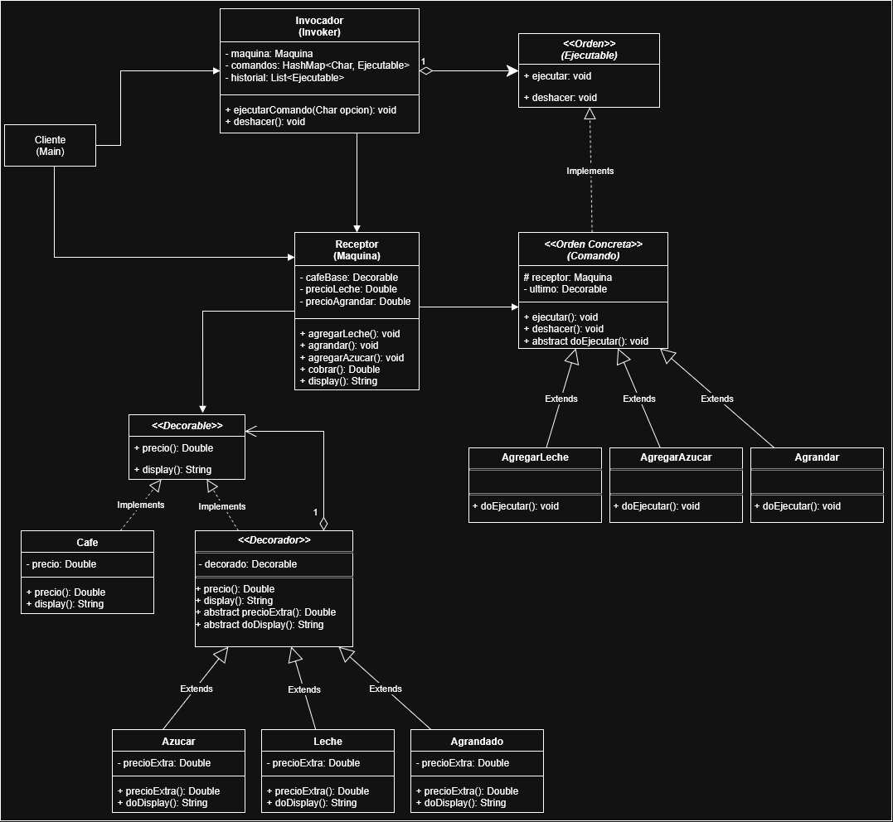

# ☕ Máquina de Café Inteligente

## Contexto

En la cafetería **CaféTech**, se está desarrollando una nueva **máquina de café inteligente**, capaz de preparar diferentes tipos de bebidas personalizadas según los gustos del cliente. 

La idea es que cada cliente pueda **armar su café paso a paso**, agregando ingredientes adicionales o modificando el tamaño de la bebida, mientras la máquina mantiene el control del pedido y calcula el precio final.

Para lograr un diseño flexible y extensible, el equipo de desarrollo decidió utilizar **dos patrones de diseño en conjunto**:

- **Decorator**, para agregar de forma dinámica los ingredientes al café base.
- **Command**, para encapsular las acciones del usuario (como agregar leche o azúcar) y permitir **deshacer la última acción**.

---

## Objetivo

Diseñar e implementar una aplicación que simule el funcionamiento de una **máquina de café configurable**, aplicando los patrones **Decorator** y **Command**.

El sistema debe permitir:
- Crear un café base y decorarlo con distintos agregados.
- Mostrar la descripción del pedido actual y su precio total.
- Registrar las acciones del usuario como comandos ejecutables.
- Permitir deshacer la última acción realizada.
- Finalizar el pedido mostrando el importe a pagar.

---

## Requerimientos

### 1. Café Base

La máquina debe iniciar siempre con un **café simple**, con un precio base configurable. A partir de este café, el usuario podrá ir agregando ingredientes o modificar el tamaño.

Cada bebida debe poder:
- Mostrar su **descripción completa** (por ejemplo: `Café - Leche - Azúcar`).
- Calcular su **precio total** sumando el café base y los agregados.

### 2. Decoradores (Patrón *Decorator*)

Los ingredientes y modificaciones deben implementarse usando el patrón **Decorator**, de forma que puedan combinarse libremente.

Todos los componentes deben implementar la interfaz:

```java
public interface Decorable {
    Double precio();
    String display();
}
```

Los posibles decoradores son:
- **Leche:** agrega un costo adicional configurable.
- **Azúcar:** agrega un costo fijo.
- **Tamaño XL:** agranda el café y aumenta su precio.

Cada decorador modifica el precio y el texto descriptivo del café que envuelve.

### 3. Comandos (Patrón *Command*)

Cada acción del usuario se encapsula en un **objeto comando** que implementa la interfaz:

```java
public interface Ejecutable {
    void execute();
    void undo();
}
```

Los comandos disponibles son:
- `AgregarLecheCommand`
- `AgregarAzucarCommand`
- `AgrandarCommand`

Cada comando debe ejecutar la acción correspondiente sobre la máquina y poder **deshacerse**.

### 4. Invocador (Invoker)

El **Invoker** administra la interacción del usuario, ejecutando los comandos según la opción elegida y manteniendo un historial de acciones.

Debe permitir:
- Ejecutar comandos (`A`, `L`, `X`).
- Deshacer la última acción (`U`).
- Terminar el pedido (`T`).

### 5. Interfaz de usuario (Main)

El programa debe funcionar por consola y mostrar un menú similar al siguiente:

```
=== MENÚ MÁQUINA DE CAFÉ ===
Pedido Actual: Café - Leche - Azúcar
a - Agregar Azúcar
x - Agrandar el Café
l - Agregar Leche
u - Deshacer última acción
T - Terminar
Seleccione una opción:
```

Al finalizar, la máquina debe mostrar el **importe total a pagar**.

---

## Ejemplo de ejecución

```
=== MENÚ MÁQUINA DE CAFÉ ===
Pedido Actual: Café
a - Agregar Azúcar
x - Agrandar el Café
l - Agregar Leche
u - Deshacer última acción
T - Terminar
Seleccione una opción: a

=== MENÚ MÁQUINA DE CAFÉ ===
Pedido Actual: Café - Azúcar
Seleccione una opción: l

=== MENÚ MÁQUINA DE CAFÉ ===
Pedido Actual: Café - Azúcar - Leche
Seleccione una opción: u

=== MENÚ MÁQUINA DE CAFÉ ===
Pedido Actual: Café - Azúcar
Seleccione una opción: T

Importe a Pagar: 2100.00
```

---

## Objetivos de diseño

- Aplicar el patrón **Decorator** para extender el comportamiento del café sin modificar su clase base.
- Aplicar el patrón **Command** para encapsular las acciones y permitir deshacer.
- Promover la **extensibilidad** del sistema para agregar nuevas funcionalidades sin afectar las existentes.


